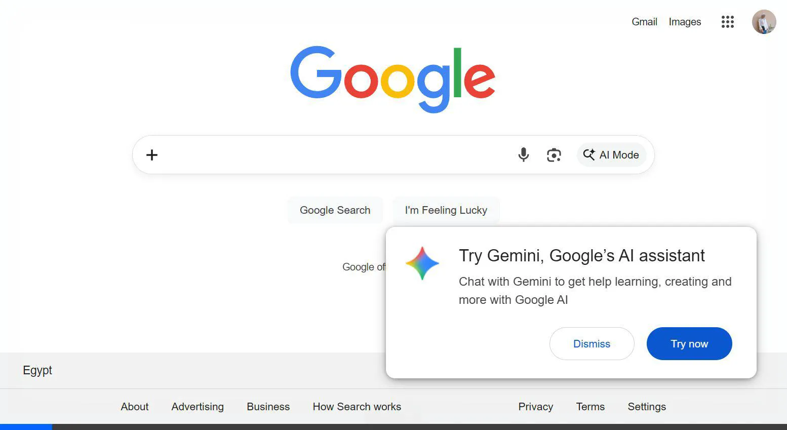

# 🕵️‍♂️ Mafioso — Crack the Case

> **A high-stakes, modern web-based detective game built with Vanilla JavaScript, HTML5, and CSS3.**

 *(Add your own screenshot here!)*

**Mafioso** is a fast-paced, immersive puzzle game where you play the lead detective. Dive into mysterious crime scenes, analyze crucial evidence, and find the real culprit before it's too late. With dynamic UI and an immediate win/lose system, every choice matters.

---

## ✨ Features

- **🎮 Dynamic Gameplay:** 
  Read the intro of each case, and investigate three key clues.
- **🥇 Instant Win Mechanic:** 
  You can pick the criminal at *any* stage. Guess correctly to win instantly!
- **🙅‍♂️ Alibi Reveals:** 
  Make a wrong guess? That suspect clears their name, drops their alibi, and leaves the investigation. 
- **⚖️ The Final Round:** 
  Reach the third clue with two suspects remaining — guess wrong here, and it's Game Over!
- **🎨 Modern "Case File" UI:** 
  - Vibrant Case-Specific Accents & Gradients
  - Animated Timeline progression
  - Character Emojis & Stylish Avatars
  - Shaking Error Animations & Confetti Successes!
- **📱 Fully Responsive:** 
  Optimized for seamless playing across Desktop, Tablet, and Mobile devices.

---

## 🛠️ Technologies Used

- **HTML5:** Semantic structure for the Single-Page Application (SPA).
- **CSS3:** Advanced flexbox/grid layouts, CSS variables for theming, custom keyframe animations, and mobile-first media queries.
- **Vanilla JavaScript:** 
  - Custom State Machine handling UI rendering seamlessly.
  - Data-centric architecture (all game content lives comfortably in a scalable `data.js` file).
  - Elegant DOM manipulation without any heavy frameworks.

---

## 🚀 How to Play Locally

1. **Clone the repository:**
   ```bash
   git clone https://github.com/your-username/mafioso-game.git
   ```
2. **Navigate to the directory:**
   ```bash
   cd mafioso-game
   ```
3. **Run a local server:**
   Because the game uses local files, you might need a simple HTTP server to avoid CORS issues.
   *Using Python:*
   ```bash
   python -m http.server 3000
   ```
   *Using Node/NPM (if `serve` is installed):*
   ```bash
   npx serve -p 3000
   ```
4. **Open your browser:**
   Go to `http://localhost:3000` to start investigating!

---

## 📂 Project Structure

```text
📁 mafioso-game
├── 📄 index.html    # The main shell and app container
├── 📄 style.css     # Premium UI styling, animations, and responsive rules
├── 📄 data.js       # The game database! Contains all case stories, clues, and suspects
└── 📄 game.js       # Core engine, State Machine, and HTML rendering logic
```

---

## 🧩 Adding New Cases

Want to write your own crime? It's incredibly easy!
Open `data.js` and add a new object to the `CASES` array. You simply define the `title`, choose an `accentColor`, write 3 clues, and define your 4 suspects. The `game.js` engine will automatically parse it and generate the UI for you!

---

*“There are two people left in this room. One of them is a liar. Who is the Mafioso?”*
